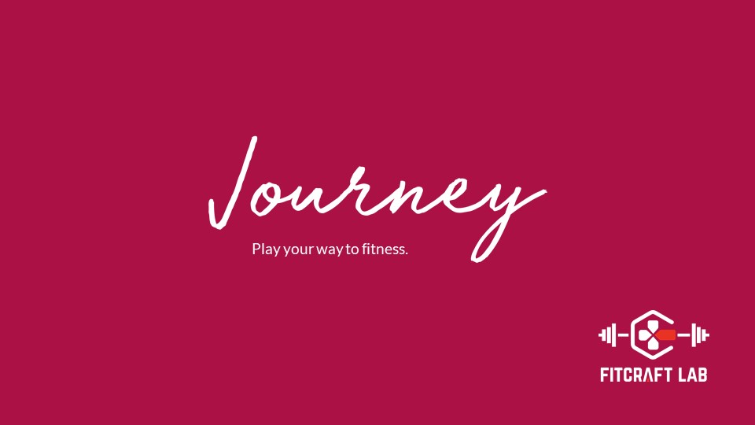
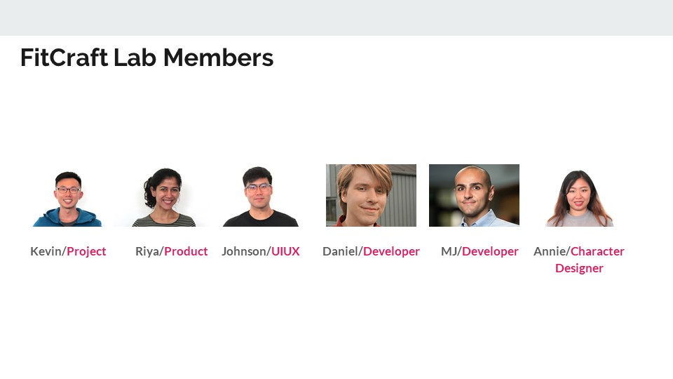
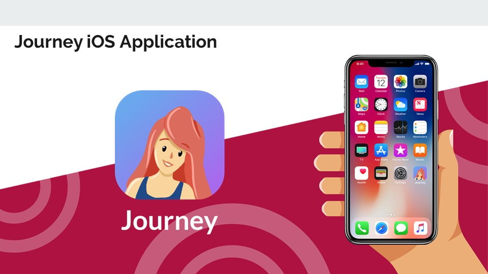
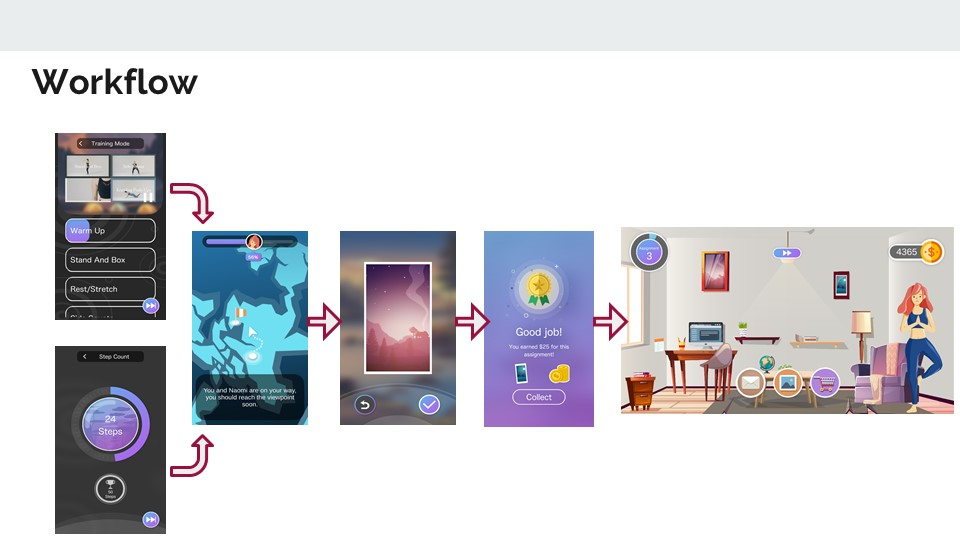
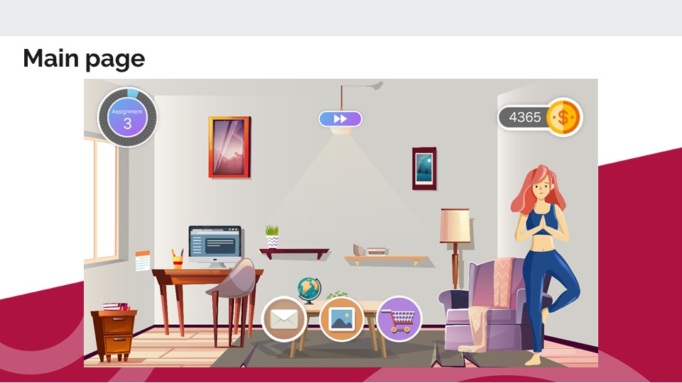
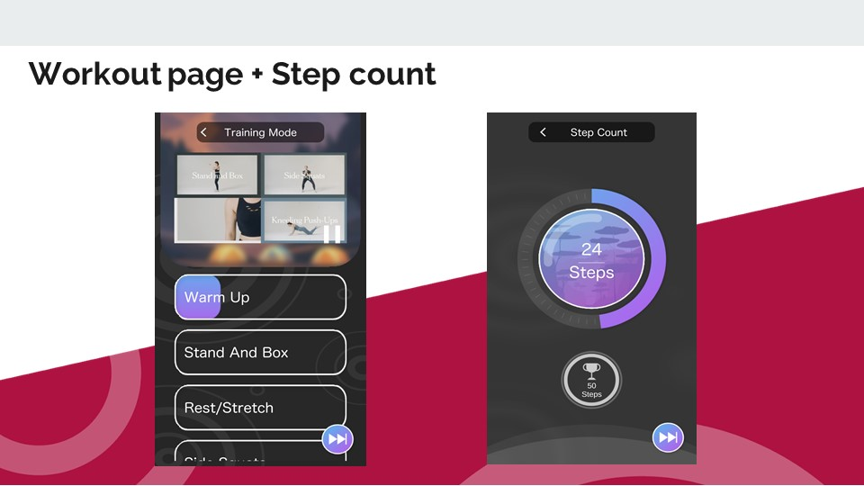
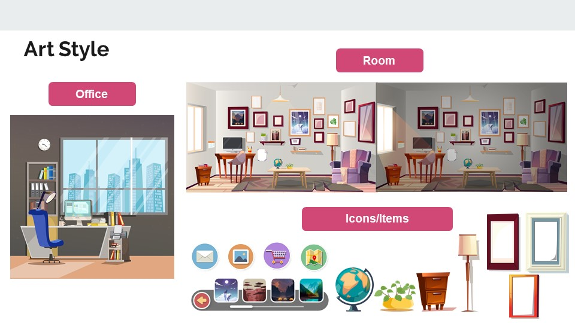
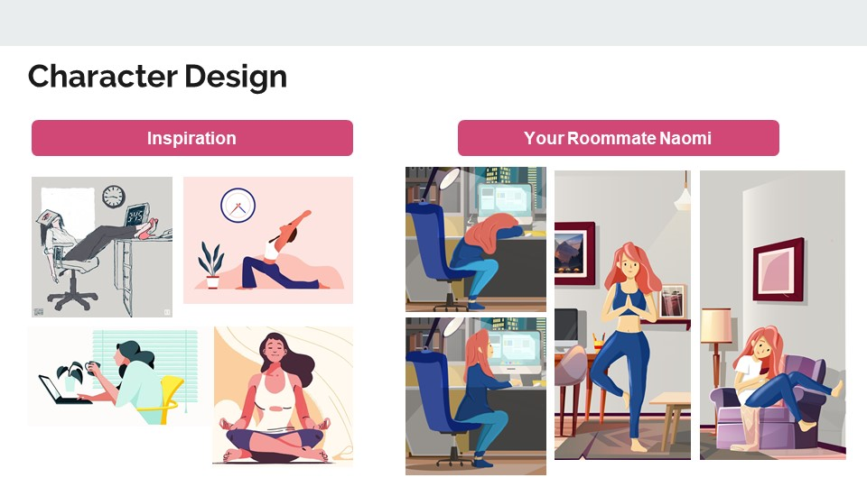
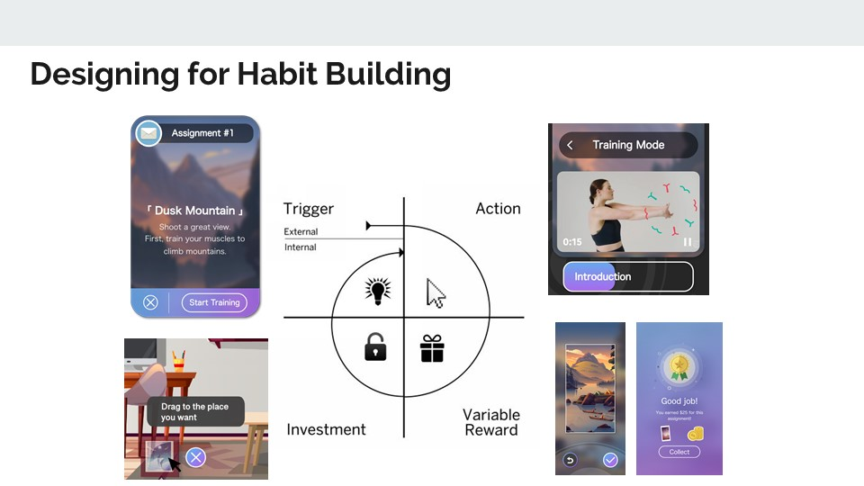
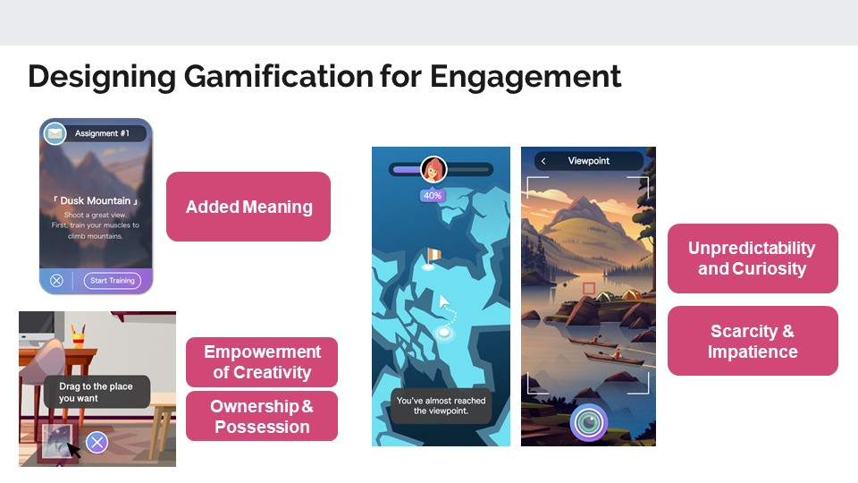

# Journey
Built by Team FitCraft Lab for Creative Labs, Journey is a gamified workout app that uses virtual world progress as a reward to motivate low-active female millennials to perform fitness activities in the physical world. This app uses engaging narrative, habit-building mechanics, and fun gamification hooks to package the workout content for the user. It is an onboarding tool to help low-active millennials to become more competent and comfortable with the workout content in a fitness app.

Client: Creative Labs Management Inc. is a start-up studio focused on developing consumer-facing technology companies and next-generation media and entertainment experiences in partnership with the Creative Artists Agency (CAA).

#### More information
To find out more about this project, please visit: https://blogs.thecdm.ca/fitcraftlab/

#### Screenshots

